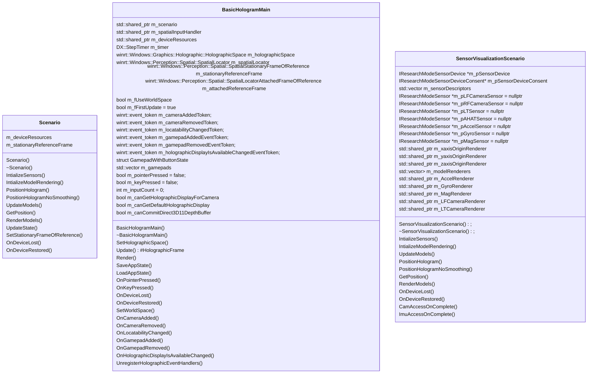

Namespace BasicHologram

```mermaid
classDiagram

class Scenario{
Scenario()
 ~Scenario()
IntializeSensors()
IntializeModelRendering()
PositionHologram()
PositionHologramNoSmoothing()
UpdateModels()
GetPosition()
RenderModels()
UpdateState()
SetStationaryFrameOfReference()
OnDeviceLost()
OnDeviceRestored()
m_deviceResources
m_stationaryReferenceFrame
}
class BasicHologramMain{
BasicHologramMain()
~BasicHologramMain()
SetHolographicSpace()
Update()#HolographicFrame
Render()
SaveAppState()
LoadAppState()
OnPointerPressed()
OnKeyPressed()
OnDeviceLost()
OnDeviceRestored()
SetWorldSpace()
OnCameraAdded()
OnCameraRemoved()
OnLocatabilityChanged()
OnGamepadAdded()
OnGamepadRemoved()
OnHolographicDisplayIsAvailableChanged()
UnregisterHolographicEventHandlers()
std::shared_ptr<Scenario> m_scenario
std::shared_ptr<SpatialInputHandler>                        m_spatialInputHandler
std::shared_ptr<DX::DeviceResources>                        m_deviceResources
DX::StepTimer                                               m_timer
winrt::Windows::Graphics::Holographic::HolographicSpace     m_holographicSpace
winrt::Windows::Perception::Spatial::SpatialLocator         m_spatialLocator
winrt::Windows::Perception::Spatial::SpatialStationaryFrameOfReference m_stationaryReferenceFrame
winrt::Windows::Perception::Spatial::SpatialLocatorAttachedFrameOfReference m_attachedReferenceFrame
bool                                                        m_fUseWorldSpace
bool                                                        m_fFirstUpdate = true
 winrt::event_token                                          m_cameraAddedToken;
 winrt::event_token                                          m_cameraRemovedToken;
 winrt::event_token                                          m_locatabilityChangedToken;
 winrt::event_token                                          m_gamepadAddedEventToken;
 winrt::event_token                                          m_gamepadRemovedEventToken;
 winrt::event_token                                          m_holographicDisplayIsAvailableChangedEventToken;
struct GamepadWithButtonState
std::vector<GamepadWithButtonState>                         m_gamepads
bool                                                        m_pointerPressed = false;
        bool                                                        m_keyPressed = false;
        int                                                         m_inputCount = 0;
  bool                                                        m_canGetHolographicDisplayForCamera
  bool                                                        m_canGetDefaultHolographicDisplay
  bool                                                        m_canCommitDirect3D11DepthBuffer

}
class SensorVisualizationScenario{
SensorVisualizationScenario();
~SensorVisualizationScenario();
IntializeSensors()
IntializeModelRendering()
UpdateModels()
PositionHologram()
PositionHologramNoSmoothing()
GetPosition()
RenderModels()
OnDeviceLost()
OnDeviceRestored()
CamAccessOnComplete()
ImuAccessOnComplete()

IResearchModeSensorDevice *m_pSensorDevice
IResearchModeSensorDeviceConsent* m_pSensorDeviceConsent
std::vector<ResearchModeSensorDescriptor> m_sensorDescriptors
IResearchModeSensor *m_pLFCameraSensor = nullptr
IResearchModeSensor *m_pRFCameraSensor = nullptr
IResearchModeSensor *m_pLTSensor = nullptr
IResearchModeSensor *m_pAHATSensor = nullptr
IResearchModeSensor *m_pAccelSensor = nullptr
IResearchModeSensor *m_pGyroSensor = nullptr
IResearchModeSensor *m_pMagSensor = nullptr


std::shared_ptr<XAxisModel>                                 m_xaxisOriginRenderer
std::shared_ptr<YAxisModel>                                 m_yaxisOriginRenderer
std::shared_ptr<ZAxisModel>                                 m_zaxisOriginRenderer
std::vector<std::shared_ptr<ModelRenderer>>                 m_modelRenderers
std::shared_ptr<AccelRenderer>                              m_AccelRenderer
std::shared_ptr<GyroRenderer>                               m_GyroRenderer
std::shared_ptr<MagRenderer>                                m_MagRenderer
std::shared_ptr<SlateCameraRenderer>                        m_LFCameraRenderer
std::shared_ptr<SlateCameraRenderer>                        m_LTCameraRenderer
}
```

