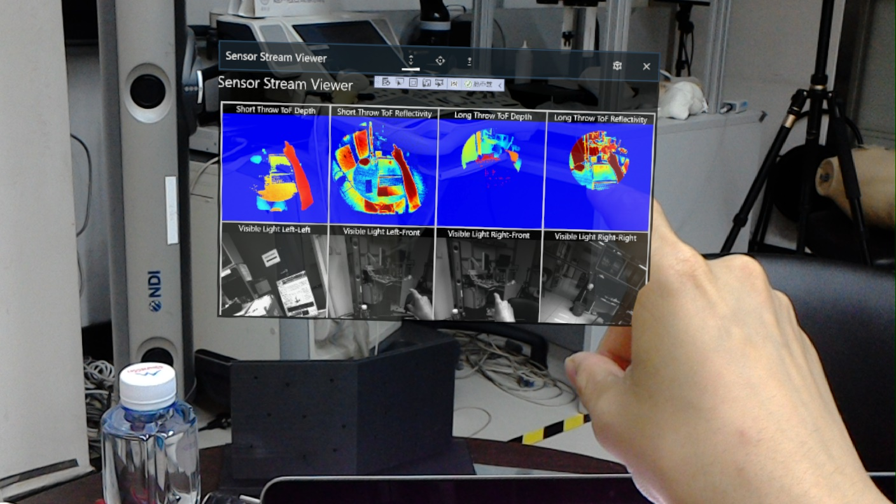

## C++上的Hololens开发记录

本部分在初始时候的目标为复现[文献(Christian,2020)](asset/paper/infrared marker tracking with hololens for neurosurgical interventions.pdf)，利用Hololens的摄像机获取IR追踪球的位置。从而计算出被标记物体的位姿，进行虚实匹配。由于目前暂时只找到了在C++上的开发者模式摄像头接口，因此采用C++进行这部分的任务。我们在Hololens2ForCV和HololensForCV的基础上进行开发。

### Hololens2ForCV

原文献采用了Hololens1，因此我原计划采用Hololens2进行开发，软件环境为vs2019

### HololensForCV

选择Debug-x86-SensorStreamViewer，调试，产生画面如下

